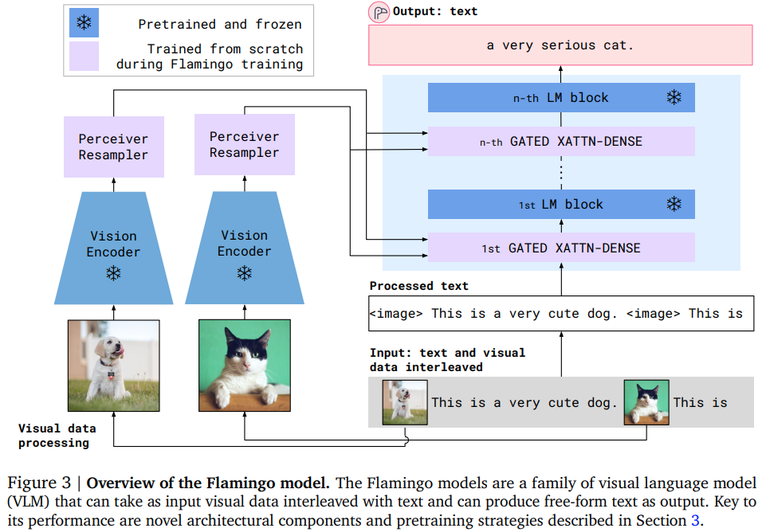

</img>

## 🦩 Flamingo - Pytorch

Implementation of <a href="https://www.deepmind.com/blog/tackling-multiple-tasks-with-a-single-visual-language-model">Flamingo</a>, state-of-the-art few-shot visual question answering attention net, in Pytorch. It will include the perceiver resampler (including the scheme where the learned queries contributes keys / values to be attended to, in addition to media embeddings), the specialized masked cross attention blocks, and finally the tanh gating at the ends of the cross attention + corresponding feedforward blocks

<a href="https://youtu.be/smUHQndcmOY?t=30">Yannic Kilcher presentation</a>

## Install

```bash
$ pip install flamingo-pytorch
```

## Usage

```python
import torch
from flamingo_pytorch import PerceiverResampler

perceive = PerceiverResampler(
    dim = 1024,
    depth = 2,
    dim_head = 64,
    heads = 8,
    num_latents = 64,    # the number of latents to shrink your media sequence to, perceiver style
    num_time_embeds = 4  # say you have 4 images maximum in your dialogue
)

medias = torch.randn(1, 2, 256, 1024) # (batch, time, sequence length, dimension)
perceived = perceive(medias) # (1, 2, 64, 1024) - (batch, time, num latents, dimension)
```

Then you insert the `GatedCrossAttentionBlock` at different intervals in your giant language model. Your text would then attend to the perceived media from above

The recommended way to derive the `media_locations` boolean tensor would be to allocate a special token id to the media, and then, at the start of your large language model, do `media_locations = text_id == media_token_id`

```python
import torch
from flamingo_pytorch import GatedCrossAttentionBlock

cross_attn = GatedCrossAttentionBlock(
    dim = 1024,
    dim_head = 64,
    heads = 8
)

text = torch.randn(1, 512, 1024)
perceived = torch.randn(1, 2, 64, 1024)

media_locations = torch.randint(0, 2, (1, 512)).bool()

text = cross_attn(
    text,
    perceived,
    media_locations = media_locations
)
```

That's it!

Attention is all you need.

## Full working example with Flamingo + PaLM 🌴🦩🌴

Integration with <a href="https://ai.googleblog.com/2022/04/pathways-language-model-palm-scaling-to.html">PaLM</a>

First install `vit-pytorch` for the vision encoder

```bash
$ pip install vit-pytorch
```

Then

```python
from vit_pytorch.vit import ViT
from vit_pytorch.extractor import Extractor

vit = ViT(
    image_size = 256,
    patch_size = 32,
    num_classes = 1000,
    dim = 1024,
    depth = 6,
    heads = 16,
    mlp_dim = 2048,
    dropout = 0.1,
    emb_dropout = 0.1
)

vit = Extractor(vit, return_embeddings_only = True)

# first take your trained image encoder and wrap it in an adapter that returns the image embeddings
# here we use the ViT from the vit-pytorch library

import torch
from flamingo_pytorch import FlamingoPaLM

# a PaLM language model, the 540 billion parameter model from google that shows signs of general intelligence

flamingo_palm = FlamingoPaLM(
    num_tokens = 20000,          # number of tokens
    dim = 1024,                  # dimensions
    depth = 12,                  # depth
    heads = 8,                   # attention heads
    dim_head = 64,               # dimension per attention head
    img_encoder = vit,           # plugin your image encoder (this can be optional if you pass in the image embeddings separately, but probably want to train end to end given the perceiver resampler)
    media_token_id = 3,          # the token id representing the [media] or [image]
    cross_attn_every = 3,        # how often to cross attend
    perceiver_num_latents = 64,  # perceiver number of latents, should be smaller than the sequence length of the image tokens
    perceiver_depth = 2          # perceiver resampler depth
)

# train your PaLM as usual

text = torch.randint(0, 20000, (2, 512))

palm_logits = flamingo_palm(text)

# after much training off the regular PaLM logits
# now you are ready to train Flamingo + PaLM
# by passing in images, it automatically freezes everything but the perceiver and cross attention blocks, as in the paper

dialogue = torch.randint(0, 20000, (4, 512))
images = torch.randn(4, 2, 3, 256, 256)

flamingo_logits = flamingo_palm(dialogue, images)

# do your usual cross entropy loss
```

It is quite evident where this is all headed if you think beyond just images.

## Inception

For factual correctness, just imagine where this system would stand if one were to use <a href="https://github.com/lucidrains/retro-pytorch">a state of the art retrieval language model</a> as the base.

## Citations

```bibtex
@article{Alayrac2022Flamingo,
    title   = {Flamingo: a Visual Language Model for Few-Shot Learning},
    author  = {Jean-Baptiste Alayrac et al},
    year    = {2022}
}
```

```bibtex
@inproceedings{Chowdhery2022PaLMSL,
    title   = {PaLM: Scaling Language Modeling with Pathways},
    author  = {Aakanksha Chowdhery and Sharan Narang and Jacob Devlin and Maarten Bosma and Gaurav Mishra and Adam Roberts and Paul Barham and Hyung Won Chung and Charles Sutton and Sebastian Gehrmann and Parker Schuh and Kensen Shi and Sasha Tsvyashchenko and Joshua Maynez and Abhishek Rao and Parker Barnes and Yi Tay and Noam M. Shazeer and Vinodkumar Prabhakaran and Emily Reif and Nan Du and Benton C. Hutchinson and Reiner Pope and James Bradbury and Jacob Austin and Michael Isard and Guy Gur-Ari and Pengcheng Yin and Toju Duke and Anselm Levskaya and Sanjay Ghemawat and Sunipa Dev and Henryk Michalewski and Xavier Garc{\'i}a and Vedant Misra and Kevin Robinson and Liam Fedus and Denny Zhou and Daphne Ippolito and David Luan and Hyeontaek Lim and Barret Zoph and Alexander Spiridonov and Ryan Sepassi and David Dohan and Shivani Agrawal and Mark Omernick and Andrew M. Dai and Thanumalayan Sankaranarayana Pillai and Marie Pellat and Aitor Lewkowycz and Erica Oliveira Moreira and Rewon Child and Oleksandr Polozov and Katherine Lee and Zongwei Zhou and Xuezhi Wang and Brennan Saeta and Mark Diaz and Orhan Firat and Michele Catasta and Jason Wei and Kathleen S. Meier-Hellstern and Douglas Eck and Jeff Dean and Slav Petrov and Noah Fiedel},
    year    = {2022}
}
```

